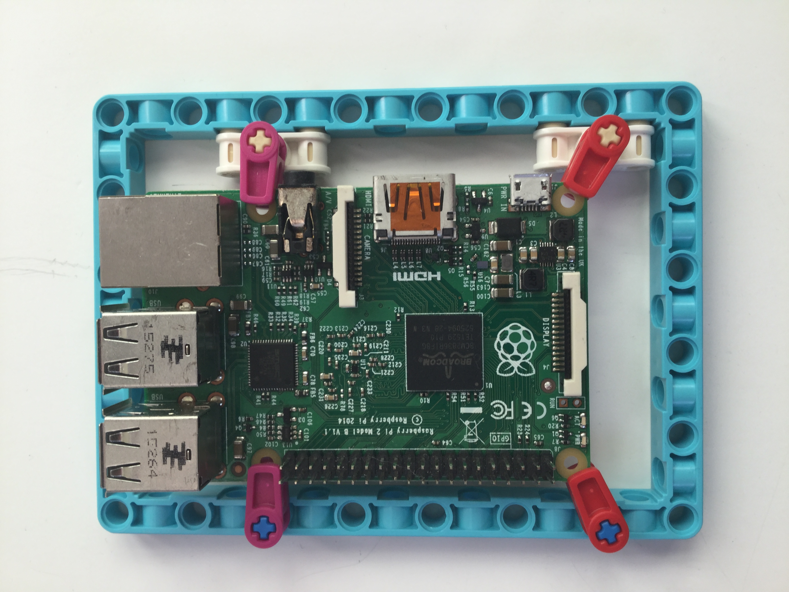
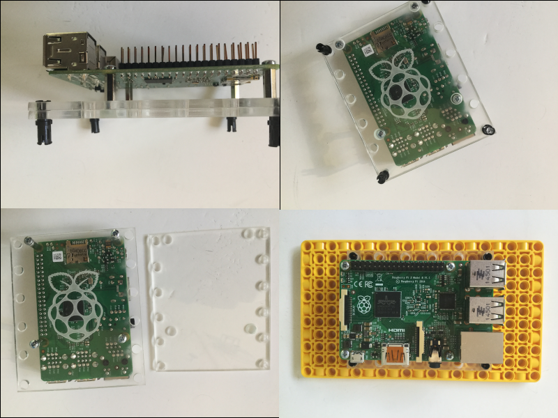

Es gibt viele Möglichkeiten, einen Raspberry Pi-Computer mit LEGO-Elementen zu verbinden oder zu montieren.

Am einfachsten ist es, die BBE zu verwenden, die mit dem Spike Prime Education-Paket geliefert wird.

Andere Optionen sind:

- Verwende den LEGO Elemente Kabelclip aus einem LEGO Education Kit.

    

- Entwirf und fertige Sie einen lasergeschnittenen oder 3D-gedruckten Adapter.

 

