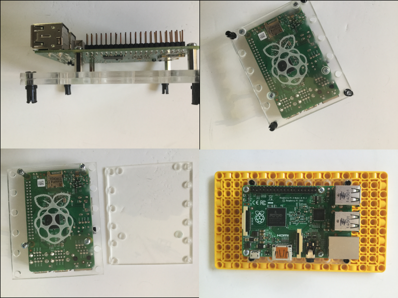

There are lots of ways to connect or mount a Raspberry Pi computer to LEGO elements.

The easiest way is to use the BBE that comes with the Spike Prime Education pack.

Other options include:

- Use the cable clip LEGO elements from a LEGO Education kit.

	

- Design and make a laser-cut or 3D printed adapter.

 
