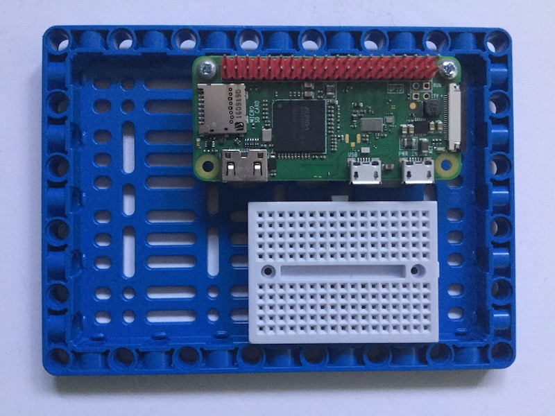

Raspberry Pi コンピューターを LEGO のエレメントに接続したりマウントしたりする方法は色々あります。

最も簡単な方法は、Spike Prime Education パックに付属している BBE を使うことです。

その他のオプションは次のとおりです:

- LEGO Education キットの LEGO ケーブルクリップのエレメントを使用します。

    

- レーザーカットまたは3Dプリントされたアダプターを設計して作成します。

 
