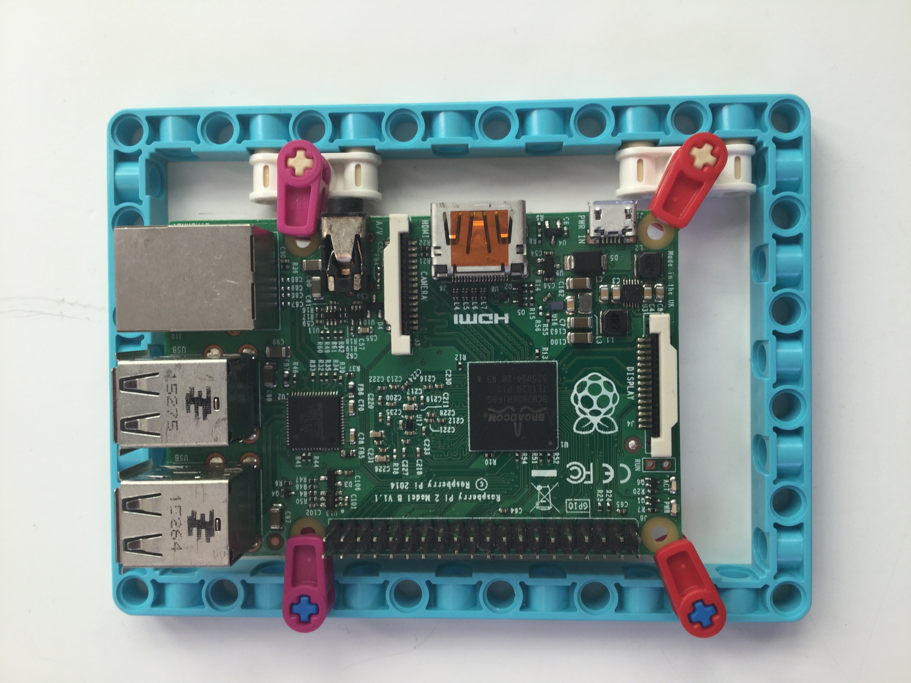

Raspberry Pi를 LEGO에 연결하거나 장착하는 방법에는 여러 가지 방법이 있습니다.

가장 쉬운 방법은 Spike Prime Education pack과 함께 제공되는 BBE를 사용하는 것입니다.

다른 옵션은 다음과 같습니다:

- LEGO Education Kit의 케이블 클립 LEGO 부품을 사용하세요.

    

- 레이저 커팅기 혹은 3D 프린터 출력용으로 설계한 어댑터를 제작합니다.

 
