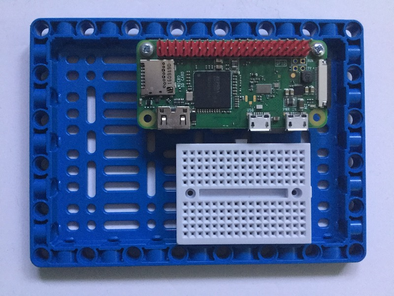
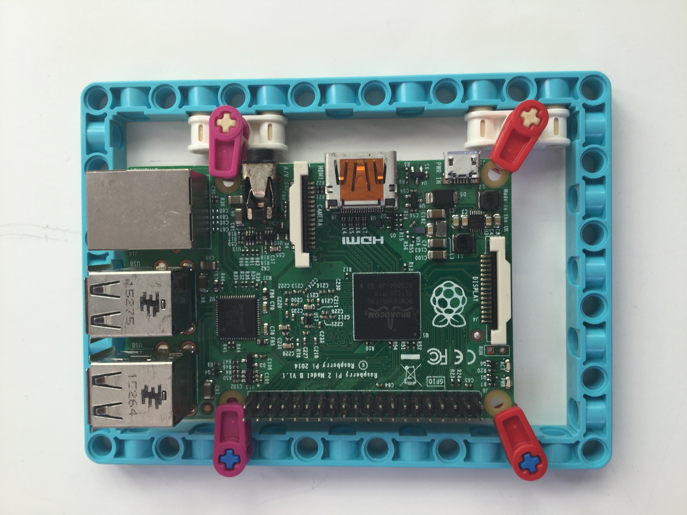

Существует множество способов подключения или монтирования компьютера Raspberry Pi к элементам LEGO.

Самый простой способ — использовать BBE, который входит в комплект Spike Prime Education.

Другие варианты включают в себя:

- Используй кабельный зажим LEGO из комплекта LEGO Education.

    

- Спроектируй и изготовь адаптер, вырезанный лазером или напечатанный на 3D-принтере.

 
